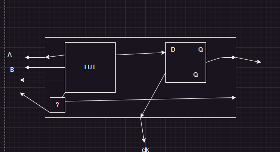

FPGA : Field programmable gate array
- reconfigurable 
- digital componets

- "blank" digital chip

core Enitity - logic cell / Logic Element
# programmed  once
    - EEPROM
    - PLA
    - PAL

- GAL  : TTL based
- PLD  : TTL BASED

FPGA is CMOS BASED

- software 
    - total reconfig
- firm ware 
    - partial renconfig
- hardware
    - no reconfig

# Boolean Algebra
product     |    sum
x.0=0       |   x+0=x
x.1=X       |   x+1=1
X.NOTX=0    |   X+notX =1   
X.X =X      |   X+X =X

# caconical sum of products.

F(A,B,C)=Sum of(0,4,5,7)

Express as esop

F(A,B,C) = NA*NB*NC +A*NB*NC+A*NB*C+A*B*C

"" = NB*NC(NA*A) + A*C(B+B)
    NB*NC +AC

- note N stands for not

- kmap 

    - form the largest group that  are power of 2 

    - pick a group   see if a varilbe changes

for higher  methods
Quinn/mcclshu method of prome implicments

# Digtial design

Combinatarial       |   Sequntial

the current outputs(o/ps) are a function of the current inputs .(ips)

- IFL Input formting Logic

the current ops are furtial of the  current ips as well as past ops/ips

- state machine 
     1. Moore
     2. mualhy
    
    - Async
    - Sync
        - it should have a clock

Difference betwenn a fip-flop and a latch

- ff edge triggered 
- latch is level

